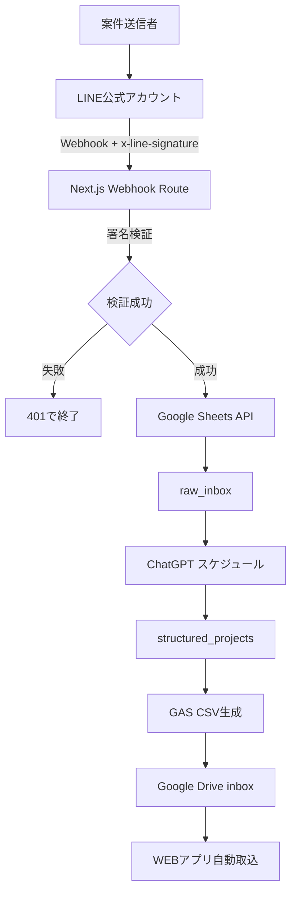

# SES案件管理WEBアプリ 基本設計 v2.5 差分
## LINE受信経路の修正

基準文書: **基本設計 v2.4**

---

## 1. 修正理由

LINE Messaging APIのWebhookは、リクエストヘッダーの`x-line-signature`と、変更を加えていないリクエスト本文を使用して署名検証する必要がある。

Google Apps ScriptのWebアプリ`doPost(e)`で公式に提供されるイベント情報には、Webhookの任意リクエストヘッダーを取得する項目が定義されていない。

このため、LINE WebhookをGoogle Apps Scriptで直接受信する構成では、基本設計で必須としている署名検証を確実に実装できない。

---

## 2. 変更前

```text
LINE
  ↓ Webhook
Google Apps Script
  ↓
Googleスプレッドシート raw_inbox
```

---

## 3. 変更後

```text
LINE
  ↓ Webhook
Next.js /api/webhooks/line
  ↓ x-line-signature検証
Google Sheets API
  ↓
Googleスプレッドシート raw_inbox
```

Google Apps Scriptは以下だけを担当する。

- structured_projectsからCSV生成
- Google Drive inboxへのCSV保存
- export_status更新
- export_batchesシート更新

---

## 4. 変更しない部分

- LINE原文の保存先はGoogleスプレッドシート`raw_inbox`
- ChatGPTスケジュール処理
- structured_projects
- GASによる30分ごとのCSV生成
- Google Drive自動取込
- project_intakesとprojectsの分離
- WEBアプリの確認・編集・正式登録

---

## 5. 追加環境変数

```env
GOOGLE_SHEETS_SPREADSHEET_ID=
LINE_CHANNEL_SECRET=
LINE_CHANNEL_ACCESS_TOKEN=
```

LINE受信処理は`LINE_CHANNEL_SECRET`を使用して署名を検証する。

---

## 6. 確定構成



以後の詳細設計では、本差分を反映した構成を正式な実装基準とする。
