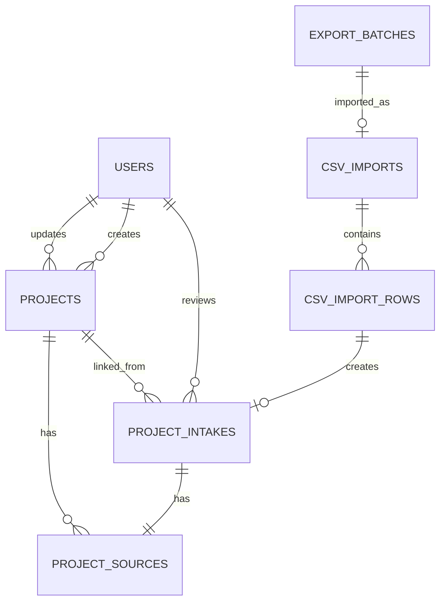

# SES案件管理WEBアプリ DB・Prisma詳細設計書
## Version 1.0

基本設計: **SES案件管理WEBアプリ 基本設計書 v2.4**

---

## 1. 設計目的

本書では、SES案件管理WEBアプリのPostgreSQLデータベースとPrisma ORMについて、実装に必要な以下を確定する。

- テーブル構成
- カラム名とデータ型
- NULL可否
- デフォルト値
- 主キー・一意制約
- 外部キー
- インデックス
- CHECK制約
- 削除方針
- ステータス
- 状態遷移
- トランザクション
- 二重処理防止
- Prisma実装規約
- マイグレーション方針

---

## 2. 確定方針

### 2.1 DB
- PostgreSQLを使用する
- Prisma Clientからアクセスする
- IDはUUIDを使用する
- 日時はPostgreSQLの`timestamptz(3)`で保存する
- 開始月・終了月は`date`型を使用し、対象月の1日を保存する
- 金額は「万円」の整数で保存する
- LINE原文は`project_sources.raw_text`を正本とする
- 未確認案件は`project_intakes`
- 正式案件は`projects`
- AI初期出力は`project_intakes.ai_snapshot`へ変更不可で保存する
- 人間が修正する値は`project_intakes`の通常カラムへ保存する
- 物理削除は原則として行わない

### 2.2 認証
Auth.jsはJWTセッション方式を使用する。

そのため初期版では以下のAuth.js用追加テーブルを作成しない。

- accounts
- sessions
- verification_tokens

Googleログイン成功後、メールアドレスで`users`を検索する。

```text
users.is_active = true
```

の利用者だけログインを許可する。

### 2.3 命名
- Prismaモデル: PascalCase
- Prismaフィールド: camelCase
- PostgreSQLテーブル: snake_case
- PostgreSQLカラム: snake_case
- Enum: UPPER_SNAKE_CASE
- インデックス・制約名: 明示的に指定する

---

## 3. テーブル一覧

| No. | テーブル | 用途 |
|---:|---|---|
| 1 | users | 利用者と権限 |
| 2 | project_intakes | AI取込済み・人間確認前の案件 |
| 3 | projects | 人間が確認した正式案件 |
| 4 | project_sources | LINE原文と送信元 |
| 5 | export_batches | GASが生成したCSVバッチ |
| 6 | csv_imports | CSVファイル単位の取込結果 |
| 7 | csv_import_rows | CSV行単位の取込結果 |

---

## 4. Enum設計

### 4.1 UserRole

| 値 | 内容 |
|---|---|
| ADMIN | 全機能、ユーザー管理 |
| OPERATOR | 案件確認・編集・正式登録 |
| VIEWER | 閲覧のみ |

### 4.2 IntakeReviewStatus

| 値 | 内容 |
|---|---|
| PENDING | 未確認 |
| REVIEWED | 新規正式案件として登録済み |
| MERGED | 既存案件へ統合済み |
| REJECTED | 対象外 |

### 4.3 ProjectStatus

| 値 | 内容 |
|---|---|
| OPEN | 募集中 |
| ON_HOLD | 保留 |
| CLOSED | 募集終了 |
| ARCHIVED | アーカイブ |

### 4.4 ExportBatchStatus

| 値 | 内容 |
|---|---|
| RESERVED | バッチ確保済み、CSV生成前 |
| CREATED | DriveへのCSV作成完了 |
| ERROR | CSV生成失敗 |

### 4.5 CsvImportStatus

| 値 | 内容 |
|---|---|
| PENDING | 取込履歴作成済み |
| PROCESSING | CSV処理中 |
| SUCCESS | 全行成功 |
| PARTIAL_SUCCESS | 正常行とエラー行が混在 |
| ERROR | ファイル全体エラー |
| SKIPPED | 同一ファイル等により処理不要 |

### 4.6 DriveMoveStatus

| 値 | 内容 |
|---|---|
| PENDING | 移動前 |
| MOVED | processedまたはerrorへ移動済み |
| MOVE_PENDING | DB処理済みだが移動再試行待ち |
| ERROR | 移動再試行が上限超過 |

### 4.7 CsvImportRowStatus

| 値 | 内容 |
|---|---|
| SUCCESS | project_intakes登録成功 |
| ERROR | 行エラー |
| SKIPPED | 重複等により登録不要 |

---

## 5. users詳細

### 5.1 用途
WEBアプリへログインする利用者と権限を管理する。

### 5.2 カラム

| カラム | Prisma型 | PostgreSQL型 | NULL | 初期値 | 説明 |
|---|---|---|---:|---|---|
| id | String | uuid | 不可 | uuid() | 主キー |
| email | String | varchar(254) | 不可 | なし | ログインメール |
| name | String | varchar(100) | 不可 | なし | 表示名 |
| role | UserRole | enum | 不可 | OPERATOR | 権限 |
| is_active | Boolean | boolean | 不可 | true | 利用可否 |
| last_login_at | DateTime | timestamptz(3) | 可 | null | 最終ログイン |
| created_at | DateTime | timestamptz(3) | 不可 | now() | 作成日時 |
| updated_at | DateTime | timestamptz(3) | 不可 | 自動 | 更新日時 |

### 5.3 制約
- `email`は一意
- アプリ側で小文字・前後空白除去を行う
- DBでも小文字のみ許可する
- 物理削除せず`is_active=false`とする

### 5.4 インデックス
- `(role, is_active)`

---

## 6. project_intakes詳細

### 6.1 用途
CSVから取り込んだAI構造化結果を保持する。

正式案件ではないため、項目不足や曖昧なデータも登録できる。

### 6.2 AI値と編集値
- `ai_snapshot`: CSV取込時点の構造化結果をJSONで固定保存
- 通常カラム: 管理者が編集する現在値
- `ai_snapshot`はPATCH APIの更新対象外
- 正式案件作成時は通常カラムを`projects`へコピーする

### 6.3 識別子

| カラム | 用途 |
|---|---|
| id | DB内部UUID |
| reception_id | システム全工程の受付ID |
| line_message_id | LINEイベントの重複防止ID |

`reception_id`と`line_message_id`はそれぞれ一意とする。

### 6.4 業務カラム

| 分類 | カラム |
|---|---|
| 基本 | project_name, project_summary |
| スキル | required_skills, preferred_skills |
| 業務 | role, process |
| 単価 | unit_price_min_man, unit_price_max_man, settlement_range |
| 期間 | start_month, end_month |
| 稼働 | work_days_per_week |
| 勤務地 | location, nearest_station |
| リモート | remote_style, remote_note |
| 条件 | recruitment_count, commercial_flow, interview_count |
| 制限 | foreigner_allowed, age_limit, nationality_note, employment_condition |

### 6.5 NULL方針
確認待ちデータでは業務項目を原則NULL許容とする。

以下が不明でも取込エラーにしない。

- 案件名
- 単価
- 開始月
- 必須スキル
- 勤務地

管理者が確認画面で補完する。

### 6.6 JSON形式

#### ai_snapshot

```json
{
  "project_name": "販売管理システム改修",
  "required_skills": ["Java", "Spring Boot"],
  "unit_price_min_man": 60,
  "unit_price_max_man": 70,
  "start_month": "2026-09",
  "warning_codes": []
}
```

#### required_skills / preferred_skills

```json
["Java", "Spring Boot", "SQL"]
```

#### warning_codes

```json
["PRICE_AMBIGUOUS", "START_MONTH_AMBIGUOUS"]
```

### 6.7 状態制約

#### PENDING
- linked_project_id: NULL
- reviewed_at: NULL
- reviewed_by_id: NULL

#### REVIEWED / MERGED
- linked_project_id: 必須
- reviewed_at: 必須
- reviewed_by_id: 必須

#### REJECTED
- linked_project_id: NULL
- reviewed_at: 必須
- reviewed_by_id: 必須

### 6.8 インデックス
- `(review_status, received_at DESC)`
- `project_name`
- `start_month`
- `linked_project_id`

### 6.9 削除
物理削除しない。対象外は`REJECTED`にする。

---

## 7. projects詳細

### 7.1 用途
管理者が確認した正式案件を保持する。

### 7.2 必須項目
正式案件登録時に以下を必須とする。

- project_name
- project_status
- created_by_id

その他の条件は案件によって存在しない場合があるためNULLを許容する。

### 7.3 project_code
表示用案件コードとして以下の形式を使用する。

```text
PJ-YYYYMMDD-XXXXXXXX
```

例:

```text
PJ-20260805-A1B2C3D4
```

生成規則:

1. `crypto.randomUUID()`を生成
2. ハイフンを除去
3. 先頭8文字を大文字化
4. 当日日付と連結
5. 一意制約違反時だけ再生成

連番は使用しないため、同時登録時の採番ロックは不要。

### 7.4 状態とarchived_at

| project_status | archived_at |
|---|---|
| OPEN | NULL |
| ON_HOLD | NULL |
| CLOSED | NULL |
| ARCHIVED | 必須 |

### 7.5 状態遷移

| 現在 | 操作 | 次 |
|---|---|---|
| OPEN | 保留 | ON_HOLD |
| OPEN | 募集終了 | CLOSED |
| ON_HOLD | 再開 | OPEN |
| CLOSED | 再募集 | OPEN |
| OPEN / ON_HOLD / CLOSED | アーカイブ | ARCHIVED |

ARCHIVEDからの復元は初期版では行わない。

### 7.6 インデックス
- `(project_status, updated_at DESC)`
- `project_name`
- `start_month`
- `location`

### 7.7 削除
物理削除しない。不要案件は`ARCHIVED`へ変更する。

---

## 8. project_sources詳細

### 8.1 用途
LINE原文、LINE識別子、送信元情報を保持する。

### 8.2 正本
LINE原文の正本は以下とする。

```text
project_sources.raw_text
```

`projects`には原文を重複保存しない。

### 8.3 関係
- project_intake_id: 必須、一意
- project_id: 正式登録・統合前はNULL
- 正式登録または統合後にproject_idを設定

### 8.4 編集
以下は原則として更新不可。

- reception_id
- line_message_id
- line_user_id
- line_group_id
- raw_text
- received_at

更新可能なのは正式案件との関連付けを行う`project_id`のみとする。

### 8.5 文字数
`raw_text`は1文字以上50,000文字以下。

### 8.6 削除
物理削除しない。

---

## 9. export_batches詳細

### 9.1 用途
Google Apps ScriptによるCSV生成バッチを記録する。

### 9.2 batch_id
形式:

```text
BATCH-YYYYMMDD-HHMMSS-XXXXXX
```

例:

```text
BATCH-20260805-183000-A1B2C3
```

### 9.3 状態

```text
RESERVED
  ↓ CSV生成・Drive保存成功
CREATED
```

失敗時:

```text
RESERVED
  ↓
ERROR
```

### 9.4 制約
- batch_id: 一意
- file_name: 一意
- drive_file_id: 一意、作成前はNULL
- target_count: 0～1,000
- CREATEDの場合、generated_atとdrive_file_idを必須とする

### 9.5 再生成
同一batch_idのDriveファイルが存在する場合、CSVを再作成しない。

既存ファイル情報を使用し、スプレッドシート上の出力状態だけを修復する。

---

## 10. csv_imports詳細

### 10.1 用途
Google Drive上のCSVをファイル単位で管理する。

### 10.2 二重取込防止
以下を一意とする。

- drive_file_id
- file_hash

Cronが重複実行された場合、先にINSERTできた処理だけが続行する。

### 10.3 file_hash
ダウンロードしたCSV全体からSHA-256を算出し、小文字64桁の16進文字列として保存する。

### 10.4 件数
- total_rows
- success_rows
- failed_rows
- skipped_rows

すべて0以上。

```text
success_rows + failed_rows + skipped_rows <= total_rows
```

### 10.5 終了状態
以下の状態では`imported_at`を必須とする。

- SUCCESS
- PARTIAL_SUCCESS
- ERROR
- SKIPPED

### 10.6 PROCESSING残留
`status=PROCESSING`かつ`processing_started_at`が2時間以上前の場合、整合性修復対象とする。

### 10.7 Drive移動
DB処理完了後にファイル移動へ失敗した場合:

```text
status = SUCCESS または PARTIAL_SUCCESS
drive_move_status = MOVE_PENDING
```

次回Cronは案件登録を行わず、ファイル移動だけ再試行する。

---

## 11. csv_import_rows詳細

### 11.1 用途
CSVの行単位の結果を保持する。

### 11.2 一意制約

```text
(csv_import_id, row_number)
```

### 11.3 SUCCESS
- project_intake_id: 必須
- error_code: NULL
- error_message: NULL

### 11.4 ERROR
例:

- REQUIRED_RECEPTION_ID
- REQUIRED_LINE_MESSAGE_ID
- DUPLICATE_ID_IN_FILE
- CSV_ROW_PARSE_ERROR
- RAW_TEXT_TOO_LONG

### 11.5 SKIPPED
例:

- DUPLICATE_RECEPTION_ID
- DUPLICATE_LINE_MESSAGE_ID

### 11.6 raw_data
取込対象行をJSONで保存する。

機密情報を追加せず、CSVに含まれていた値だけを保持する。

### 11.7 削除
親の`csv_imports`を削除する場合だけCASCADEする。

ただし通常運用ではcsv_imports自体を物理削除しない。

---

## 12. ER図



---

## 13. 外部キー・削除方針

| 子 | 親 | onDelete | 理由 |
|---|---|---|---|
| project_intakes.reviewed_by_id | users | SET NULL | 退職者を無効化しても案件を保持 |
| project_intakes.linked_project_id | projects | RESTRICT | 正式案件の誤削除防止 |
| projects.created_by_id | users | RESTRICT | 作成者の参照を維持 |
| projects.updated_by_id | users | SET NULL | 更新者無効化を許容 |
| project_sources.project_intake_id | project_intakes | RESTRICT | 原文消失防止 |
| project_sources.project_id | projects | RESTRICT | 原文との関連消失防止 |
| csv_imports.export_batch_id | export_batches | SET NULL | 取込履歴を独立保持 |
| csv_import_rows.csv_import_id | csv_imports | CASCADE | ファイル履歴削除時だけ行も削除 |
| csv_import_rows.project_intake_id | project_intakes | SET NULL | 取込履歴を保持 |

運用上は、users・project_intakes・projects・project_sources・csv_importsを物理削除しない。

---

## 14. トランザクション設計

### 14.1 CSV行の正常取込
1行ごとにトランザクションを実行する。

```text
BEGIN
  project_intakes INSERT
  project_sources INSERT
  csv_import_rows INSERT SUCCESS
COMMIT
```

途中失敗時は当該行だけROLLBACKし、`csv_import_rows`へERRORを別トランザクションで保存する。

### 14.2 正式案件登録

```text
BEGIN
  project_intakesをPENDING条件で取得
  projects INSERT
  project_sources.project_id UPDATE
  project_intakesをREVIEWEDへUPDATE
COMMIT
```

更新条件:

```text
id = 対象ID
AND review_status = PENDING
```

更新件数が0件の場合は409 Conflict。

### 14.3 既存案件への統合

```text
BEGIN
  project_intakesをPENDING条件で取得
  必要に応じてprojectsをUPDATE
  project_sources.project_id UPDATE
  project_intakesをMERGEDへUPDATE
COMMIT
```

原文は変更しない。

### 14.4 対象外

```text
BEGIN
  project_intakesをPENDING条件でREJECTEDへUPDATE
COMMIT
```

### 14.5 CSVファイル確定

```text
BEGIN
  csv_importsの件数と最終statusをUPDATE
COMMIT
```

Drive移動はDBトランザクション外で実行する。

移動失敗時は`drive_move_status=MOVE_PENDING`へ更新する。

---

## 15. 同時実行・競合制御

### 15.1 CSV取込
`drive_file_id`の一意制約で処理権を確保する。

```text
INSERT csv_imports
```

が一意制約違反となった処理は、同一ファイル処理済みとして終了する。

### 15.2 確認待ち案件
正式登録、統合、対象外は必ず以下を条件に更新する。

```text
review_status = PENDING
```

複数画面から同時操作された場合、先に成功した操作だけを有効とする。

後続処理は409 Conflictを返す。

### 15.3 通常編集
`PATCH /api/project-intakes/{id}`および`PATCH /api/projects/{id}`では、リクエストに`updatedAt`を含める。

DB上の`updated_at`と一致しない場合は409 Conflictとし、古い画面からの上書きを防止する。

専用versionカラムは追加しない。

---

## 16. バリデーション

### 16.1 project_intakes
- project_name: 255文字以下
- 単価: 0以上
- 単価下限 <= 単価上限
- work_days_per_week: 1～7
- recruitment_count: 1以上
- interview_count: 0以上
- start_month <= end_month
- required_skills: JSON配列
- preferred_skills: JSON配列
- warning_codes: JSON配列

### 16.2 projects
正式登録時:
- project_name必須
- project_nameは空白のみ不可
- project_code必須
- created_by_id必須
- その他はproject_intakesと同一制約

### 16.3 project_sources
- raw_text必須
- raw_text: 1～50,000文字
- reception_id必須
- line_message_id必須

### 16.4 csv_imports
- file_hash: 小文字16進64桁
- 各件数: 0以上
- 合計件数がtotal_rowsを超えない

---

## 17. 検索設計

### 17.1 確認待ち一覧
主な条件:

- review_status
- received_at範囲
- project_name部分一致
- start_month
- warning_codes有無
- source_company

ページング:

```text
50件単位
received_at DESC, id DESC
```

### 17.2 正式案件一覧
主な条件:

- project_status
- project_name部分一致
- start_month
- location
- required_skills
- preferred_skills

初期版では文字列・JSONの単純検索を使用する。

データ量と実測を確認してから`pg_trgm`や全文検索を追加する。

### 17.3 CSV取込履歴
主な条件:

- status
- drive_move_status
- created_at範囲
- file_name
- batch_id

---

## 18. Prisma実装規約

### 18.1 Prisma Client
アプリ全体でPrismaClientを単一化する。

開発時のHot Reloadで接続が増加しない構成にする。

### 18.2 select
APIレスポンスに不要なカラムを返さない。

特に以下は一覧APIで返さない。

- ai_snapshot
- raw_text
- raw_data
- error_message全文

### 18.3 更新
入力オブジェクトをそのままPrismaへ渡さない。

更新可能フィールドを明示的に抽出する。

### 18.4 JSON
JSON値はZod等で構造を検証してから保存する。

- required_skills: string[]
- preferred_skills: string[]
- warning_codes: string[]
- ai_snapshot: object

### 18.5 Date
`YYYY-MM`を受け取った場合、UTCの月初日へ変換して`date`型へ保存する。

表示時は`YYYY-MM`へ戻す。

### 18.6 金額
単価は万円整数。

```text
60万円 → 60
70.5万円 → 原則として入力拒否
```

---

## 19. マイグレーション方針

### 19.1 初期作成
1. `schema.prisma`を配置
2. Prisma migrationを生成
3. 生成されたmigration.sqlへ`database_constraints.sql`の内容を追記
4. 開発DBへ適用
5. Prisma Client生成
6. seed実行

### 19.2 本番
- 本番で`db push`を使用しない
- migrationファイルをGitHub管理する
- Dokployデプロイ時にmigrationを適用する
- 破壊的変更前にDBバックアップを取得する

### 19.3 カラム削除
即時削除しない。

1. アプリから参照を停止
2. 1リリース保持
3. データ確認
4. 次回migrationで削除

---

## 20. 初期Seed

### 20.1 管理者
環境変数から初期ADMINを登録する。

```env
INITIAL_ADMIN_EMAIL=
INITIAL_ADMIN_NAME=
```

Seed処理:
- emailをtrim・lowercase
- 既存ならroleとis_activeを更新
- 未登録ならADMINとして作成

### 20.2 サンプルデータ
本番Seedでは案件データを作成しない。

開発環境のみ、別のdevelopment seedで以下を作成可能とする。

- PENDING intake
- 警告付きintake
- OPEN project
- PARTIAL_SUCCESS import

---

## 21. エラーコード

### DB・競合

| コード | HTTP | 内容 |
|---|---:|---|
| INTAKE_ALREADY_PROCESSED | 409 | 既に正式登録・統合・対象外 |
| OPTIMISTIC_LOCK_CONFLICT | 409 | 更新日時不一致 |
| DUPLICATE_RECEPTION_ID | 409 | 受付ID重複 |
| DUPLICATE_LINE_MESSAGE_ID | 409 | LINEメッセージID重複 |
| DUPLICATE_DRIVE_FILE | 409 | Driveファイル重複 |
| DUPLICATE_FILE_HASH | 409 | 同一内容CSV |
| INVALID_STATE_TRANSITION | 409 | 状態遷移不正 |
| FOREIGN_KEY_RESTRICTED | 409 | 関連データにより削除不可 |
| VALIDATION_ERROR | 400 | 入力値不正 |

---

## 22. テスト観点

### 22.1 制約
- 単価下限 > 上限を拒否
- 週稼働8日を拒否
- 終了月 < 開始月を拒否
- raw_text 50,001文字を拒否
- JSON配列以外を拒否
- 小文字でないメールを拒否
- ARCHIVEDでarchived_atなしを拒否

### 22.2 一意性
- reception_id重複
- line_message_id重複
- drive_file_id重複
- file_hash重複
- batch_id重複
- CSV内row_number重複

### 22.3 トランザクション
- project作成後にsource更新失敗した場合、projectもROLLBACK
- 99行成功・1行失敗でPARTIAL_SUCCESS
- Drive移動失敗時、案件登録を再実行しない

### 22.4 競合
- 同じintakeを2人が正式登録
- 古いupdatedAtによる上書き
- Cron二重実行

---

## 23. 成果物

本詳細設計に対応する実装用ファイル:

- `schema.prisma`
- `database_constraints.sql`

---

## 24. 詳細設計完了条件

- 7テーブルのカラムが確定している
- Enumと状態遷移が確定している
- NULL可否が確定している
- 一意制約・外部キーが確定している
- DBレベルCHECK制約が定義されている
- 削除方針が確定している
- CSV取込トランザクションが確定している
- 正式案件登録・統合・対象外のトランザクションが確定している
- 同時実行時の競合処理が確定している
- Prisma schemaへ反映されている
