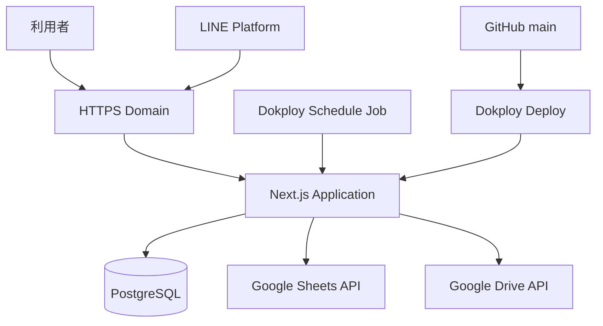

# SES案件管理WEBアプリ Google Drive・Dokploy詳細設計書
## Version 1.0

---

## 1. 配備構成



### 1.1 Dokployサービス
- Application: `ses-project-manager-web`
- Database: `ses-project-manager-db`
- Schedule Jobs:
  - Drive取込
  - Drive移動再試行
  - PROCESSING整合性修復
  - DBバックアップ

専用Cronコンテナは作成しない。

---

## 2. Google Drive

### 2.1 ルート

```text
SES営業システム
Folder ID: 1TlsmeCDe2PK-S9dWRaRVTtpTq5Pty7IE
```

### 2.2 配下
- inbox
- processed
- error
- SES案件取込管理スプレッドシート

### 2.3 初期作成
フォルダIDを取得し、Dokploy環境変数へ設定する。

### 2.4 サービスアカウント
Google Cloud Projectでサービスアカウントを作成する。

共有:
- ルートフォルダ: 編集者
- スプレッドシート: 編集者

### 2.5 API
Drive:
- files.list
- files.get
- files.update

Sheets:
- spreadsheets.values.get
- spreadsheets.values.append
- spreadsheets.values.update

### 2.6 Drive移動
ファイル親を更新する。

成功:
- addParents=processed
- removeParents=inbox

失敗:
- addParents=error
- removeParents=inbox

### 2.7 Retry
Google API:
- 429
- 500
- 502
- 503
- 504

は指数バックオフで最大3回。

例:
- 1秒
- 2秒
- 4秒
- ランダムジッター

認証・権限エラーは自動再試行しない。

---

## 3. Next.js Application

### 3.1 Runtime
- Node.js LTS
- Next.js App Router
- Route Handlers
- Prisma Client
- 1インスタンスから開始

### 3.2 ポート

```text
3000
```

### 3.3 Health Check

```text
GET /api/health
```

- 200: applicationとDB正常
- 503: DB接続不能

### 3.4 Dockerfile方針
Multi-stage build。

段階:
1. dependencies
2. build
3. runner

runner:
- production dependenciesだけ
- rootユーザーで実行しない
- `next start`
- Prisma生成物を含める

### 3.5 起動
起動前に:

```text
npx prisma migrate deploy
```

Migration失敗時はアプリを起動しない。

単一インスタンス前提の初期構成。

---

## 4. PostgreSQL

### 4.1 永続化
Dokploy PostgreSQLの永続Volumeを使用する。

### 4.2 接続
同一Dokployネットワーク内のホスト名を使用する。

```env
DATABASE_URL=postgresql://...
```

### 4.3 接続数
初期版は小規模のため、Prismaの標準的な接続管理から開始する。

接続枯渇が発生した場合に接続上限・プール設定を調整する。

### 4.4 タイムゾーン
DB保存はtimestamptz。

アプリ表示はAsia/Tokyo。

---

## 5. Dokploy環境

### 5.1 Project

```text
ses-sales-system
```

Environment:
- production
- 将来必要ならstaging

### 5.2 Domain
例:

```text
ses.example.jp
```

- HTTPS有効
- LINE WebhookはHTTPS必須
- HTTPからHTTPSへリダイレクト

### 5.3 GitHub
- Repository接続
- Branch: main
- main更新で自動デプロイ
- Pull Requestでは本番デプロイしない

### 5.4 Deploy順序
1. GitHubから取得
2. Docker build
3. Container作成
4. Prisma migrate deploy
5. Application起動
6. Health Check
7. 正常なら切替
8. 失敗なら旧コンテナ維持またはロールバック

---

## 6. Dokploy Schedule Jobs

DokployのApplication Jobを使用し、対象アプリコンテナ内でコマンドを実行する。

Timezone:

```text
Asia/Tokyo
```

### 6.1 Drive取込

```text
Name: drive-import
Cron: */30 * * * *
Command: node scripts/drive-import-cron.mjs
```

処理:
- MOVE_PENDING
- PROCESSING残留
- inbox新規ファイル

を1実行内で順に処理する。

### 6.2 移動再試行
通常はDrive取込内で実行するため、別Jobは初期状態で無効。

障害対応用:

```text
Name: drive-move-retry
Cron: 10 * * * *
Command: node scripts/drive-move-retry.mjs
Enabled: false
```

### 6.3 整合性修復
通常はDrive取込内で実行する。

障害対応用:

```text
Name: import-reconcile
Cron: 20 * * * *
Command: node scripts/import-reconcile.mjs
Enabled: false
```

### 6.4 DBバックアップ

```text
Name: postgres-backup
Cron: 0 2 * * *
Timezone: Asia/Tokyo
```

バックアップ詳細はテスト・運用設計書に定義する。

### 6.5 重複実行
Drive取込はDBのdrive_file_id一意制約で冪等性を確保する。

Dokploy Jobが重複開始しても二重登録しない。

---

## 7. 環境変数

### 7.1 Application

```env
NODE_ENV=production
APP_URL=https://<APP_DOMAIN>
AUTH_SECRET=

DATABASE_URL=

GOOGLE_PROJECT_ID=
GOOGLE_CLIENT_EMAIL=
GOOGLE_PRIVATE_KEY=
GOOGLE_SHEETS_SPREADSHEET_ID=

GOOGLE_DRIVE_ROOT_FOLDER_ID=1TlsmeCDe2PK-S9dWRaRVTtpTq5Pty7IE
GOOGLE_DRIVE_INBOX_FOLDER_ID=
GOOGLE_DRIVE_PROCESSED_FOLDER_ID=
GOOGLE_DRIVE_ERROR_FOLDER_ID=

LINE_CHANNEL_SECRET=
LINE_CHANNEL_ACCESS_TOKEN=

CRON_SECRET=
CSV_SCHEMA_VERSION=v1
CHATGPT_PROMPT_VERSION=PROJECT-PARSER-1

INITIAL_ADMIN_EMAIL=
INITIAL_ADMIN_NAME=
TZ=Asia/Tokyo
```

### 7.2 区分

Project共有:
- TZ
- CSV_SCHEMA_VERSION
- CHATGPT_PROMPT_VERSION

Application秘密:
- AUTH_SECRET
- DATABASE_URL
- GOOGLE_PRIVATE_KEY
- LINE_CHANNEL_SECRET
- LINE_CHANNEL_ACCESS_TOKEN
- CRON_SECRET

Application通常:
- APP_URL
- 各Google ID
- INITIAL_ADMIN

### 7.3 改行秘密鍵
環境変数内の`\n`を起動時に実改行へ変換する。

### 7.4 `.env.example`
値を空欄にした成果物をGitHubへ保存する。

---

## 8. デプロイ前チェック

- DBバックアップ
- Migration確認
- 環境変数差分
- Googleフォルダ共有
- LINE Webhook URL
- LINE署名秘密
- Health Check
- Schedule Job無効化の要否
- 破壊的変更なし

---

## 9. デプロイ後チェック

1. `/api/health` 200
2. Googleログイン
3. 確認待ち一覧
4. Drive接続正常
5. LINE Developers Webhook検証
6. テストメッセージがraw_inboxへ保存
7. Cron手動実行
8. ログに秘密情報がない
9. Migration適用済み
10. Schedule Job有効

---

## 10. ログ

### Application
- stdout/stderr
- JSON形式推奨
- requestId
- event
- status
- elapsedMs

### Dokploy
- Deployment log
- Schedule Job execution log
- Container log

### 保持
初期運用はDokployの標準ログ範囲。

長期保持が必要になった場合に外部ログ基盤を追加する。

---

## 11. リソース

初期:
- Next.js: 1 instance
- PostgreSQL: 1 instance
- Cron: Schedule Job
- Redisなし
- Queueなし

監視:
- CPU
- Memory
- Disk
- Container restart
- PostgreSQL容量

閾値の初期目安:
- Disk 80%で確認
- Memory 85%継続で確認
- Container restart発生時に調査

---

## 12. 障害時

### Application停止
- Dokployで再起動
- 直前デプロイ後ならロールバック
- LINE Webhook未受信期間をLINE Consoleで確認

### DB停止
- Applicationをメンテナンス状態
- PostgreSQL再起動
- 復旧不可ならバックアップ復元

### Google API障害
- DBと画面は継続
- LINE保存・Drive取込だけ失敗
- 復旧後に再送・次回Cron

### Disk不足
- processed整理
- Docker不要イメージ確認
- DBバックアップ確認
- 容量拡張

---

## 13. 公式仕様との整合性
- Dokploy Schedule Jobsでcron式とApplication Jobを使用
- DokployのProject/Environment/Service環境変数を利用
- Next.js App Router Route Handlersを利用
- Drive APIでlist/get/updateを使用
